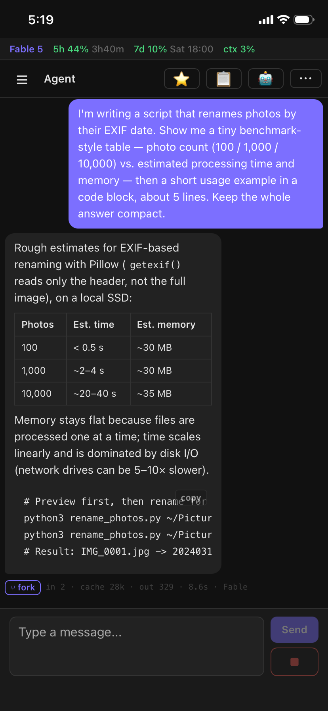
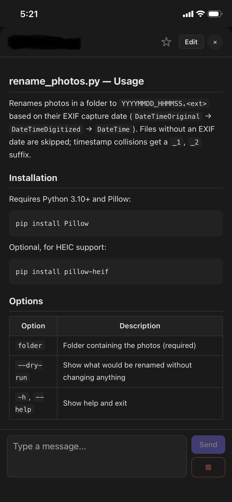
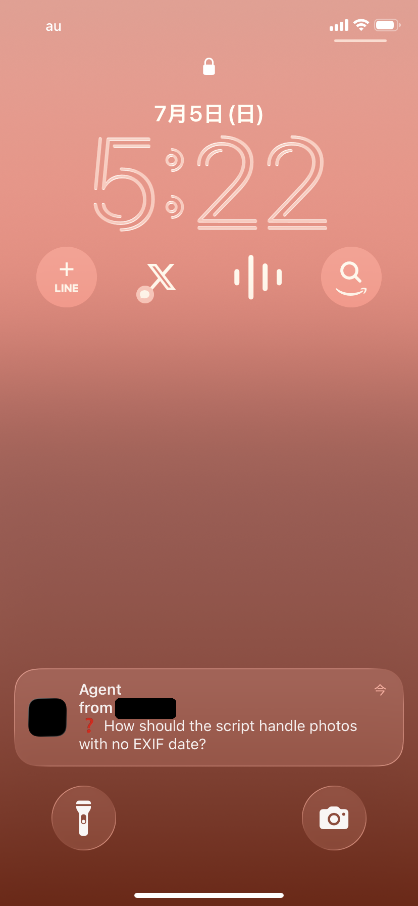

# Claude PWA Client

> 🇯🇵 日本語版: [README.ja.md](README.ja.md)

> **Unofficial third-party client for Claude Code. Not affiliated with Anthropic. Apache 2.0, provided AS IS ([LICENSE](./LICENSE)).**

> **Self-hosted, single-user by design.** Run the backend on your own machine, against your own Claude subscription (or API key), for your own use. Exposing it to serve additional users — routing Anthropic consumer authentication "on behalf of their users" — is unsupported and against Anthropic's usage policy. See [Claude Code — Legal and compliance](https://code.claude.com/docs/en/legal-and-compliance).

A PWA client for operating [Claude Code](https://docs.claude.com/en/docs/claude-code) (Anthropic's official CLI) from your smartphone. Your phone's browser connects over Tailscale to a backend running on your host machine; add it to the home screen and use it as a standalone PWA. The backend launches the `claude` CLI as a real PTY + tmux subprocess, staying within the Anthropic Usage Policy (the subscription / API key choice is left to the user; no tokens are extracted).


<p align="center">
  
  
  
</p>

## Features

- **Chat**: multiple concurrent sessions, tab switching, incremental SSE rendering
- **Background continuation**: processing continues host-side while the screen is closed; on return the client reconnects and catches up on the delta
- **Web Push notifications**: proactive prompts such as `AskUserQuestion` are pushed to iOS / Android; notification mode is switchable per session
- **Terminal prompt detection + quick replies**: when the terminal is waiting for input — permission dialogs, y/n confirmations, password prompts, option pickers, even ones raised by subprocesses — a banner above the chat box shows the prompt excerpt, a push notification fires, and one-tap quick-reply buttons (numbers / Y-n / arrow keys) answer it without opening the terminal view
- **Proactive auto-delivery**: turns initiated by the agent (`Monitor` / `cron` / `ScheduleWakeup`, etc.) appear immediately
- **Subagent / workflow viewer**: browse `Task` / `Workflow` transcripts in a dedicated panel
- **Notification-center sync**: OS notifications, badges, and the backend unread counter are reconciled when the PWA returns to the foreground
- **File preview**: tap a path to render Markdown with syntax highlighting for 50+ languages
- **File tree + favorites**: browse the tree from the ⋯ menu, star favorites for one-tap navigation
- **Task panel**: the 📋 button lists tasks created via `TaskCreate`
- **Image / text attachments**: multipart upload with persisted history
- **Tool activity inline**: every tool call (Bash, Edit, Write, …) appears as a collapsible row in the conversation — tap to expand its input and result; while a subagent runs, its current sub-tool is shown on the row
- **Status bar**: model, 5h / 7d rate-limit usage with reset times, and context usage, always on; plan mode, remaining budget, and a mentioned-PR chip appear when the session provides them
- **Conversation forking**: branch any message into a new tab; parents and children are shown hierarchically in the drawer
- **Persistent message history**: compressed with lz-string into localStorage
- **Multi-account**: switch between personal / work etc. via the `accounts` config (see [docs/reference/config.md](docs/reference/config.md))

### Optional extras

- **Desktop screen sharing**: mirror the host desktop inside the PWA and control it by touch, via [Sunshine](https://github.com/LizardByte/Sunshine) + [moonlight-web-stream](https://github.com/MrCreativ3001/moonlight-web-stream). See [docs/setup/path-b-screenshare.md](docs/setup/path-b-screenshare.md)

## Architecture

```
[Smartphone]                     [Host machine]
                                ┌──────────────────────┐
   PWA (Safari/Chrome) ─────┐   │ FastAPI backend      │
       │                    │   │   ├ Claude Code CLI  │
       │                    ├─▶ │   │   subprocess     │
       │                    │   │   └ Web Push (VAPID) │
   Add to home screen,      │   │                      │
   launch standalone        │   │ moonlight-web-stream │ ← optional
                            │   │   └ Sunshine         │ ← optional
                            │   └──────────────────────┘
                            │              ↕ Tailscale
                            └──────────────┘
```

- The backend runs resident on the host and launches the `claude` CLI as a **real PTY + tmux** subprocess (no SDK, no `--print` non-interactive mode). Output flows JSONL tail → SSE; input goes through tmux
- Works as-is with your existing Claude Code subscription (Pro / Max) — no API key, no metered billing
- The smartphone reaches the host over HTTPS via Tailscale; nothing is exposed to the public internet

For the detailed layer structure and the SSE / JSONL / tmux responsibilities, see [docs/internals/architecture/overview.md](docs/internals/architecture/overview.md).

## Security model

This repository is designed for a personal host machine exposed only inside a Tailscale tailnet. It has no authentication / authorization layer for public-internet deployment. Under the assumption that "anyone who can reach the tailnet has the equivalent of a login on the host", it enforces a minimal set of boundaries:

- **`/file` (GET/PUT) is restricted to HOME plus a secrets deny list** (truth: `backend/routes/files.py::_DENY_RE`):
  - SSH: `~/.ssh/`, and the bare filenames `authorized_keys` / `id_rsa` / `id_ed25519` / `id_ecdsa` / `id_dsa` / `known_hosts`
  - Cloud credentials: `~/.aws/`, `~/.gnupg/`, `~/.docker/`, `~/.kube/`, `~/.config/gh/`, `~/.netrc`
  - Shell init / history: `~/.zshrc` / `~/.zshenv` / `~/.zprofile` / `~/.bashrc` / `~/.bash_profile` / `~/.profile` / `~/.zsh_history` / `~/.bash_history`
  - Extensions: `*.pem` / `*.key` / `*.p12` / `*.pfx`
- **`/hooks/event` accepts localhost only**: claude CLI hooks are loopback by design
- **Markdown URLs pass through react-markdown's standard sanitizer**: dangerous schemes like `javascript:` / `data:` are blocked (only the internal `cpc-file://` is passed through)
- **Web Push subscriptions / VAPID keys are stored as JSON under `backend/secrets/` / `backend/data/`** (gitignored; see `docs/reference/data-schemas.md`)

WebSockets (`/ws/pty/{sid}`, `/views/ws`, `/jsonl/stream/{sid}`) and the `/sessions/*` HTTP surface carry no authentication and rely on tailnet ACLs. Public or multi-tenant deployment would require additional middleware auth.

For vulnerability reporting, the audit log, and the full threat model, see [SECURITY.md](SECURITY.md).

## Setup

The user-facing entry points are unified behind `task` ([go-task](https://taskfile.dev) required; on macOS `brew install go-task/tap/go-task`). `task --list` shows everything. `task setup` never touches user-global settings such as `~/.claude/settings.json` or shell rc files (avoiding unintended overwrites). The four prerequisites below are on you.

Two-stage structure:

- **Path A** (chat + notifications only): [docs/setup/path-a-chat.md](docs/setup/path-a-chat.md)
- **Path B** (Path A + desktop screen sharing): [docs/setup/path-b-screenshare.md](docs/setup/path-b-screenshare.md)
- **Windows (WSL2)**: [docs/setup/windows-wsl.md](docs/setup/windows-wsl.md)

### Prerequisites (the four common stumbling points — clear these before `task setup`)

1. **Put the `claude` CLI on PATH** and define a **`launch_alias` shell alias per agent** (e.g. `alias agent_a='cd /path/to/agent_a && claude'`) in `~/.zshrc` or similar (details: [docs/setup/path-a-chat.md](docs/setup/path-a-chat.md))
2. **Claude hook settings** — without the backend `/hooks/event` POST hook in `~/.claude/settings.json`, no history appears in chat ([path-a-chat.md](docs/setup/path-a-chat.md))
3. **Statusline settings** — the StatusBar stays empty unless your statusline appends `rate_limits` to the JSONL ([path-a-chat.md](docs/setup/path-a-chat.md))
4. **`jq` / `tmux`** required, plus **Tailscale** installed on both the host and the phone, joined to the same tailnet

### Fastest path (Path A, macOS / Linux)

```bash
git clone https://github.com/Synforger/claude-pwa-client.git
cd claude-pwa-client

# 1. One-shot setup (conda env / pip / npm / config / VAPID / git hooks)
task setup
# → edit backend/config.json (agents / claude_path / accounts)

# 2. Build the frontend + run the backend (foreground, Ctrl-C to stop)
task build
task run

# In another shell, publish to the tailnet
task tailscale-serve
```

Open `https://<your-host>.tail<xxxx>.ts.net/` on your phone; on iOS Safari use Share → Add to Home Screen to install it as a PWA. Enable notifications from the ⋯ menu → "Enable notifications" (requires iOS 16.4+ and the home-screen install).

### Resident operation (LaunchAgent, recommended on macOS)

```bash
task install-service      # places ~/Library/LaunchAgents/<label>.plist + prints editing guidance
# edit the absolute paths inside the plist, then:
launchctl bootstrap gui/$(id -u) ~/Library/LaunchAgents/com.claudepwa.client.plist
task status               # one-shot check: LaunchAgent + port + 12-item /debug/healthcheck
```

For Linux (including WSL2) see [docs/setup/windows-wsl.md](docs/setup/windows-wsl.md); on Windows use the same procedure inside WSL2.

### After a host reboot

LaunchAgent KeepAlive should bring everything back up; check with `task status` first. If unresponsive, `task restart` kickstarts it; logs via `task logs`. Detailed recovery steps: [docs/troubleshooting/troubleshoot.md](docs/troubleshooting/troubleshoot.md).

## Configuration

Skeleton of `backend/config.json` (copy from `backend/config.example.json`):

```json
{
  "agents": {
    "agent_a": {
      "cwd": "/path/to/agent_a",
      "model": "Opus",
      "display_name": "Agent A",
      "launch_alias": "agent_a"
    }
  },
  "accounts": {
    "personal": { "display_name": "Personal", "env": {} },
    "work": { "display_name": "Work", "env": { "CLAUDE_CONFIG_DIR": "<path-to-your-claude-config-dir>" } }
  },
  "claude_path": "/path/to/claude",
  "rate_limits_log": "/path/to/rate-limits.jsonl",
  "notification_title": "Claude",
  "cors_allow_origins": []
}
```

Every field (`agents` / `accounts` / `claude_path` / `launch_alias`, etc.) and `frontend/.env.local` are documented in [docs/reference/config.md](docs/reference/config.md).

## Troubleshooting

Common stumbling points and recovery procedures are collected in [docs/troubleshooting/troubleshoot.md](docs/troubleshooting/troubleshoot.md) (Chromium HTTPS certificate errors, Sunshine encoder hangs, broken moonlight pairing, `__pycache__` import accidents, the PWA bundle update flow, claude_sid recovery after a session ends, and more).

## Documentation

- User guide index: [docs/README.md](docs/README.md)
- Setup: [docs/setup/path-a-chat.md](docs/setup/path-a-chat.md) (Path A, fastest on macOS / Linux) / [docs/setup/path-b-screenshare.md](docs/setup/path-b-screenshare.md) (add screen sharing) / [docs/setup/windows-wsl.md](docs/setup/windows-wsl.md) (Windows)
- When stuck: [docs/troubleshooting/troubleshoot.md](docs/troubleshooting/troubleshoot.md)
- Configuration reference: [docs/reference/config.md](docs/reference/config.md)

Internal material for contributors lives in [docs/internals/](docs/internals/) (you never need it just to use the PWA).

## License

Apache License 2.0 (see `LICENSE` / `NOTICE`).

Dependency license audit (2026-06-29): all backend Python deps and frontend npm production deps are **permissive** (MIT / BSD / Apache-2.0 / ISC / MPL-2.0 weak copyleft / PSF / CC0-1.0); zero strong copyleft (GPL / AGPL / LGPL / SSPL). The per-package listing and license summary live in [`THIRD_PARTY_NOTICES.md`](THIRD_PARTY_NOTICES.md).

Sunshine / moonlight-web-stream are GPL-3.0, but this repository neither bundles nor links them: they run as separate processes and are integrated over HTTP / WebRTC, so GPL copyleft does not propagate (per the FSF GPL FAQ, process separation does not normally create a derivative work). In particular, moonlight-web-stream is only loaded by the PWA frontend as `<iframe src="/moonlight/">` — a web server the user builds and runs separately, reverse-proxied via Tailscale Serve (this repo ships neither its source nor binaries; an iframe is a separate document context, i.e. aggregation, not a derivative work). Device-side Moonlight clients (iOS / Android / PC native apps) are not part of this repo's path (the PWA is browser-only and uses moonlight-web-stream exclusively).

Derivative works must retain `NOTICE` and mark modified key files accordingly (Apache-2.0 §4). When adding / removing / bumping dependencies, regenerate `THIRD_PARTY_NOTICES.md` with `task gen-notices`.

## Acknowledgements

- [Claude Code](https://docs.claude.com/en/docs/claude-code) — Anthropic's official CLI
- [Sunshine](https://github.com/LizardByte/Sunshine) — self-hosted game streaming server
- [moonlight-web-stream](https://github.com/MrCreativ3001/moonlight-web-stream) — bridge that receives Sunshine in the browser over WebRTC
